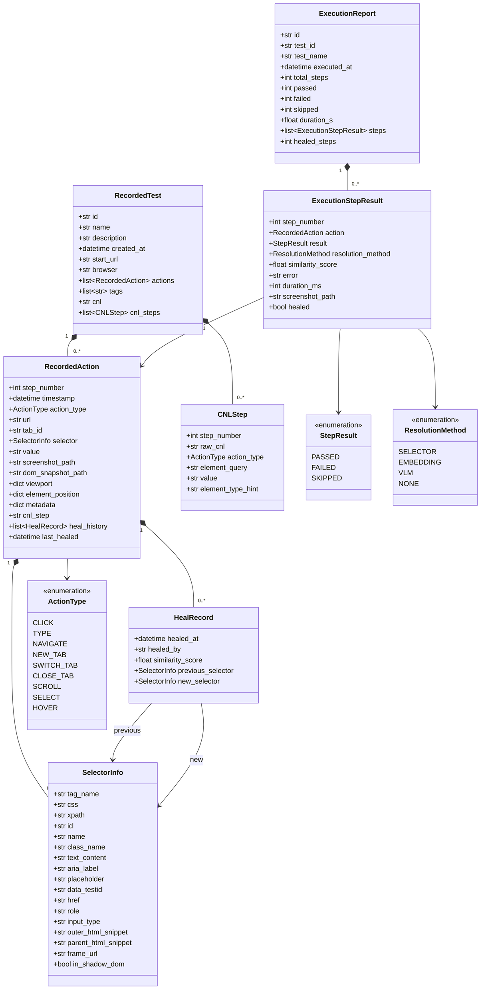
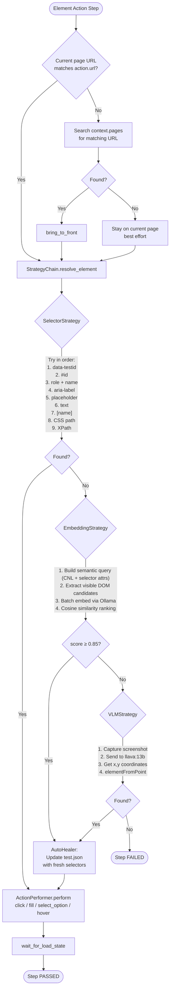
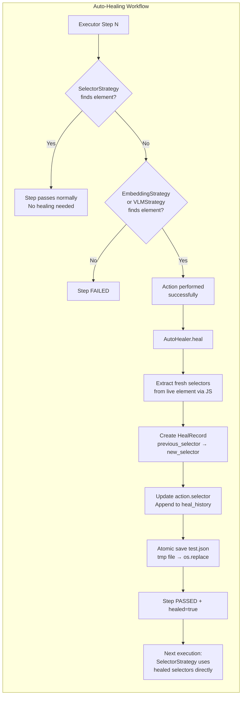
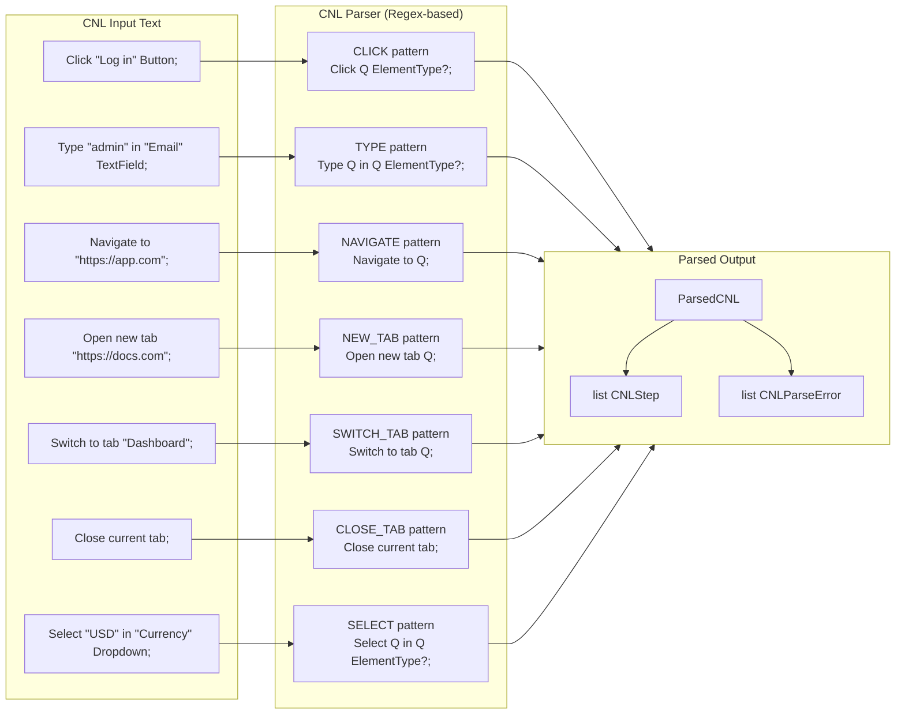
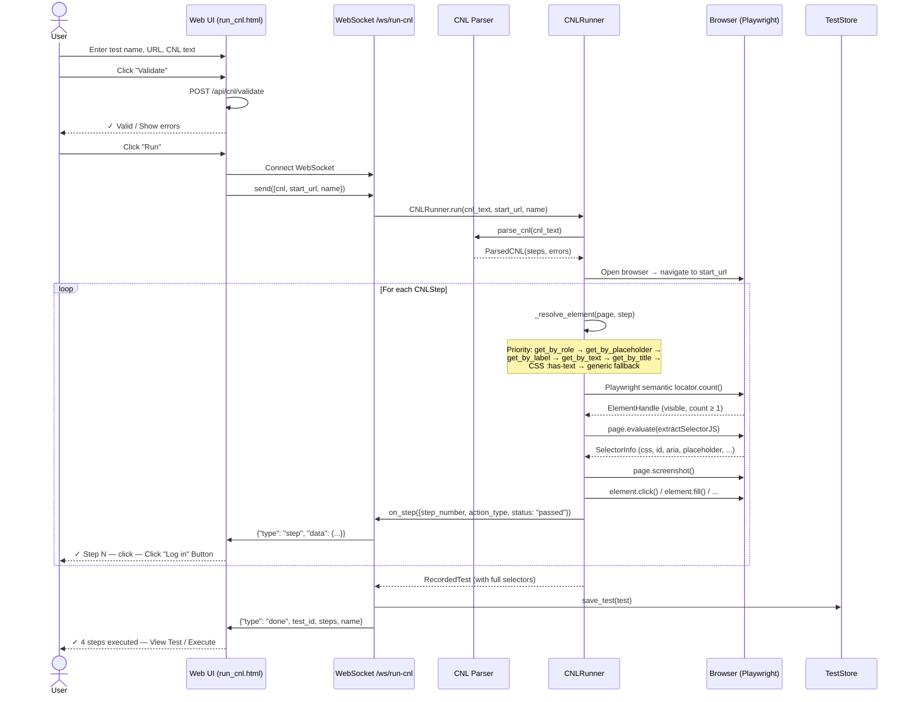
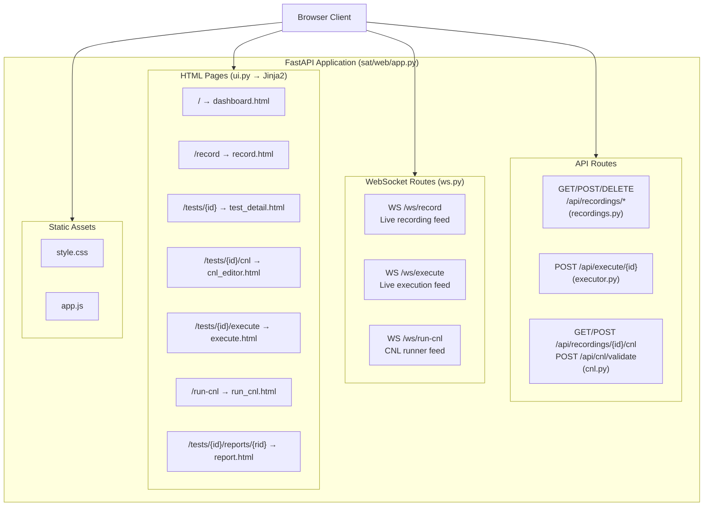
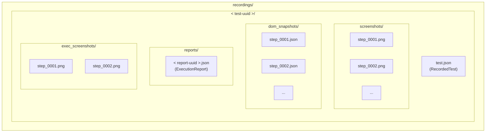

# SAT — Selenium Activity Tool: Detailed Technical Report

> **Version:** 0.1.0  
> **Date:** March 2, 2026  
> **Repository:** `shreyash-Pandey-Katni/SAT`  
> **Runtime:** Python 3.11+ · Playwright · Ollama · FastAPI

---

## Table of Contents

1. [Executive Summary](#1-executive-summary)
2. [System Architecture](#2-system-architecture)
3. [Core Data Models](#3-core-data-models)
4. [Recording Engine](#4-recording-engine)
5. [Execution Engine](#5-execution-engine)
6. [Resolution Strategy Chain](#6-resolution-strategy-chain)
7. [Auto-Healing System](#7-auto-healing-system)
8. [CNL (Constraint Natural Language) Subsystem](#8-cnl-constraint-natural-language-subsystem)
9. [Run CNL Feature](#9-run-cnl-feature)
10. [Web UI Architecture](#10-web-ui-architecture)
11. [Storage & Persistence](#11-storage--persistence)
12. [AI Services Integration](#12-ai-services-integration)
13. [Configuration System](#13-configuration-system)
14. [CLI Interface](#14-cli-interface)
15. [Deployment](#15-deployment)
16. [Project Structure](#16-project-structure)
17. [Key Design Decisions](#17-key-design-decisions)

---

## 1. Executive Summary

**SAT (Selenium Activity Tool)** is an event-driven browser test recorder and intelligent executor built on Playwright and Ollama. It enables users to:

- **Record** browser interactions in real-time with zero polling (CDP WebSocket push)
- **Execute** recorded tests with a 3-stage AI-powered fallback chain that adapts to UI changes
- **Auto-heal** broken selectors by atomically updating test files when fallback strategies succeed
- **Generate CNL** — human-readable test step descriptions automatically generated during recording
- **Run CNL** — directly execute hand-written CNL text against a live browser, producing a complete replayable test case
- **Manage tests** via a web dashboard or CLI

### Technology Stack

| Layer | Technology |
|-------|-----------|
| Browser Automation | Playwright (async API, CDP WebSocket) |
| AI — Embeddings | Ollama + nomic-embed-text (cosine similarity) |
| AI — Vision | Ollama + llava:13b (coordinate detection) |
| Data Models | Pydantic v2 |
| Web Framework | FastAPI + Jinja2 + WebSocket |
| CLI | Typer + Rich |
| Configuration | TOML |
| Storage | JSON files on disk |
| Containerization | Docker + Docker Compose |

---

## 2. System Architecture

The system is organized into six major subsystems connected through a shared core layer:

```mermaid
graph TB
    subgraph User["User Interfaces"]
        CLI["CLI (Typer)"]
        WebUI["Web UI (FastAPI + Jinja2)"]
    end

    subgraph Core["Core Layer"]
        Models["Pydantic Models<br/>(RecordedTest, RecordedAction,<br/>SelectorInfo, ExecutionReport)"]
        PM["PlaywrightManager"]
        BF["BrowserFactory"]
        Config["SATConfig<br/>(TOML Loader)"]
    end

    subgraph Recorder["Recorder Engine"]
        Rec["Recorder (Orchestrator)"]
        EL["EventListener"]
        CaptJS["capture.js<br/>(Browser-side)"]
        AB["ActionBuilder"]
        SE["SelectorExtractor"]
        CNLG["CNLGenerator"]
        NT["NavigationTracker"]
        DS["DOMSnapshot"]
    end

    subgraph Executor["Executor Engine"]
        Exec["Executor (Orchestrator)"]
        SC["StrategyChain"]
        AP["ActionPerformer"]
        AH["AutoHealer"]
        RG["ReportGenerator"]
        CR["CNLRunner"]
    end

    subgraph Strategies["Resolution Strategies"]
        S1["1. SelectorStrategy<br/>(CSS, XPath, ARIA, ID)"]
        S2["2. EmbeddingStrategy<br/>(Cosine Similarity)"]
        S3["3. VLMStrategy<br/>(Visual Detection)"]
    end

    subgraph Services["AI Services (Ollama)"]
        OE["OllamaEmbeddingService<br/>(nomic-embed-text)"]
        OV["OllamaVLMService<br/>(llava:13b)"]
        DP["DOMParser"]
    end

    subgraph CNL["CNL Subsystem"]
        Parser["CNL Parser"]
        Validator["CNL Validator"]
        CNLModels["CNLStep / ParsedCNL"]
    end

    subgraph Storage["Persistence"]
        TS["TestStore (JSON CRUD)"]
        FS["File System<br/>(recordings/)"]
    end

    subgraph Browser["Browser (Playwright)"]
        Chrome["Chromium / Firefox"]
        CDP["CDP WebSocket"]
    end

    CLI --> Rec
    CLI --> Exec
    WebUI --> Rec
    WebUI --> Exec
    WebUI --> CR

    Rec --> PM
    Exec --> PM
    CR --> PM
    PM --> BF
    BF --> Chrome
    Chrome <--> CDP

    Rec --> EL
    EL --> CaptJS
    EL --> AB
    EL --> SE
    EL --> CNLG
    EL --> NT
    EL --> DS

    Exec --> SC
    Exec --> AP
    Exec --> AH
    Exec --> RG

    SC --> S1
    SC --> S2
    SC --> S3

    S2 --> OE
    S2 --> DP
    S3 --> OV

    CR --> Parser
    WebUI --> Validator
    CLI --> Validator

    Rec --> TS
    Exec --> TS
    CR --> TS
    TS --> FS

    Config -.-> Rec
    Config -.-> Exec
    Config -.-> CR
    Config -.-> BF

    Models -.-> Rec
    Models -.-> Exec
    Models -.-> TS
```



### Architecture Principles

| Principle | Implementation |
|-----------|---------------|
| **Zero Polling** | All browser ↔ Python communication uses CDP WebSocket push via `page.expose_function()` and `page.on()` |
| **Event-Driven** | Playwright auto-wait after actions; no explicit sleeps |
| **Separation of Concerns** | Recorder, Executor, CNL, Services are independent subsystems |
| **Atomic Persistence** | All file writes use `tmp → os.replace` to prevent corruption |
| **Cross-Platform** | Auto-detects system Chrome on Linux, macOS, and Windows |

---

## 3. Core Data Models

All data models are defined as Pydantic v2 `BaseModel` classes in `sat/core/models.py`:



### Key Model Relationships

- **`RecordedTest`** is the top-level entity containing all actions, CNL text, and metadata
- **`RecordedAction`** represents a single user interaction with rich selector data and auto-heal history
- **`SelectorInfo`** stores 16+ attributes for element identification (CSS, XPath, ARIA, data-testid, shadow DOM flag, iframe URL, etc.)
- **`HealRecord`** tracks every auto-heal event with before/after selectors and the method that found the element
- **`ExecutionReport`** aggregates step-level results with pass/fail/healed counts

### Action Types

| ActionType | Description | Requires Element |
|-----------|-------------|:---:|
| `CLICK` | Click on an element | ✓ |
| `TYPE` | Type text into an input | ✓ |
| `SELECT` | Select option from dropdown | ✓ |
| `HOVER` | Hover over an element | ✓ |
| `NAVIGATE` | User-initiated URL change | ✗ |
| `NEW_TAB` | Open a new browser tab | ✗ |
| `SWITCH_TAB` | Switch focus to another tab | ✗ |
| `CLOSE_TAB` | Close the current tab | ✗ |
| `SCROLL` | Scroll the page | ✗ |

---

## 4. Recording Engine

The recorder uses a fully **event-driven** architecture with zero polling. All browser events flow through CDP WebSocket.

### Recording Sequence

```mermaid
sequenceDiagram
    actor User
    participant Browser as Browser (Chromium)
    participant CaptureJS as capture.js (In-Browser)
    participant CDP as CDP WebSocket
    participant EventListener as EventListener
    participant NavTracker as NavigationTracker
    participant ActionBuilder as ActionBuilder
    participant CNLGen as CNLGenerator
    participant Recorder as Recorder
    participant TestStore as TestStore

    User->>Browser: Open URL & interact
    Note over User,Browser: User clicks, types, navigates

    rect rgb(30, 60, 90)
        Note over Browser,EventListener: Event-Driven Capture (Zero Polling)
        Browser->>CaptureJS: DOM event (click/input/change)
        CaptureJS->>CaptureJS: Extract selector info,<br/>bounding box, shadow DOM check
        CaptureJS->>CDP: page.exposeFunction callback
        CDP->>EventListener: __sat_click(data) / __sat_input(data) / __sat_select(data)
    end

    EventListener->>NavTracker: on_user_interaction("click", href)
    EventListener->>EventListener: Capture screenshot + DOM snapshot
    EventListener->>ActionBuilder: build_click(data, step, url, tab_id)
    ActionBuilder-->>EventListener: RecordedAction

    EventListener->>CNLGen: generate(action)
    CNLGen-->>EventListener: 'Click "Log in" Button;'

    EventListener->>Recorder: on_action(action)
    Recorder->>Recorder: Append to actions list

    Note over Browser,EventListener: Navigation Events
    Browser->>EventListener: page.on("framenavigated")
    EventListener->>NavTracker: is_user_initiated(url)?
    NavTracker-->>EventListener: true/false
    Note over EventListener: Only records if user-initiated

    Note over Browser,EventListener: New Tab Events
    Browser->>EventListener: context.on("page")
    EventListener->>ActionBuilder: build_new_tab() + build_switch_tab()
    EventListener->>EventListener: attach(newPage) — wire capture.js

    User->>Recorder: stop() (Ctrl+C or Web UI)
    Recorder->>Recorder: Build RecordedTest with CNL
    Recorder->>TestStore: save_test(test)
    TestStore-->>Recorder: recordings/{id}/test.json
```

### Recording Components

| Component | File | Purpose |
|-----------|------|---------|
| **Recorder** | `recorder/recorder.py` | Orchestrator — manages lifecycle, collects actions, builds `RecordedTest` |
| **EventListener** | `recorder/event_listener.py` | Attaches to Playwright pages, routes CDP events to callbacks |
| **capture.js** | `recorder/capture.js` | In-browser script injected via `add_init_script()` — captures click/input/select DOM events with full selector extraction, Shadow DOM traversal, and deduplication |
| **ActionBuilder** | `recorder/action_builder.py` | Constructs `RecordedAction` objects from raw event data |
| **SelectorExtractor** | `recorder/selector_extractor.py` | Builds `SelectorInfo` from event payloads |
| **CNLGenerator** | `recorder/cnl_generator.py` | Converts `RecordedAction` → human-readable CNL string |
| **NavigationTracker** | `recorder/navigation_tracker.py` | Distinguishes user-initiated navigations from click-caused ones using a causation window |
| **DOMSnapshot** | `recorder/dom_snapshot.py` | Captures full DOM state for each step |

### Key Technical Details

**capture.js injection strategy:**
1. `page.add_init_script(path)` — registers for future navigations/frame-attaches
2. `frame.evaluate(code)` — immediately evaluates on all existing frames (main + iframes)
3. Guard variable `window.__sat_capture_installed` prevents double-installation

**Shadow DOM handling:**
- `capture.js` traverses shadow roots to build correct CSS selectors
- Uses Nx-dedup: `Set`-based tracking prevents duplicate event reporting across shadow boundaries

**Navigation causation:**
- Click on `<a href="...">` records CLICK but NOT the resulting navigation
- Causation window: any navigation within 2000ms of a recorded click/type is suppressed
- `href`-based tracking also catches navigations that arrive beyond the time window

**Tab tracking:**
- `_active_tab_id` tracks which tab last received an action
- `_maybe_emit_switch_tab()` automatically inserts SWITCH_TAB when actions arrive from a different tab
- `context.on("page")` fires for new tabs/popups and wires up capture.js on them

---

## 5. Execution Engine

The executor replays recorded tests with intelligent element resolution and auto-healing.

### Execution Sequence

```mermaid
sequenceDiagram
    actor Trigger as CLI / Web UI
    participant Executor as Executor
    participant SC as StrategyChain
    participant S1 as SelectorStrategy
    participant S2 as EmbeddingStrategy
    participant S3 as VLMStrategy
    participant Ollama as Ollama (Local AI)
    participant AP as ActionPerformer
    participant AH as AutoHealer
    participant Browser as Browser Page
    participant RG as ReportGenerator

    Trigger->>Executor: execute(RecordedTest)
    Executor->>Browser: Open start_url

    loop For each RecordedAction
        Executor->>Executor: _ensure_correct_page(page, action)
        Note over Executor: Compare action.url vs page.url<br/>Switch context.pages if mismatched

        alt Tab/Nav Action (navigate, new_tab, switch_tab, close_tab, scroll)
            Executor->>AP: perform(page, null, action)
            AP-->>Executor: new_page | null
        else Element Action (click, type, select, hover)
            Executor->>SC: resolve_element(page, action)

            rect rgb(20, 70, 30)
                Note over SC,S1: Strategy 1: Direct Selectors
                SC->>S1: resolve(page, action)
                S1->>Browser: Try data-testid → ID → role+name →<br/>aria-label → placeholder → text →<br/>name → CSS → XPath
                alt Found
                    S1-->>SC: (ElementHandle, null)
                else Not Found
                    S1-->>SC: (null, null)

                    Note over SC,S2: Strategy 2: Semantic Embeddings
                    SC->>S2: resolve(page, action)
                    S2->>Browser: Extract DOM candidates
                    S2->>Ollama: embed_batch([query + candidates])
                    Ollama-->>S2: Embedding vectors
                    S2->>S2: Cosine similarity ranking
                    alt score ≥ 0.85
                        S2-->>SC: (ElementHandle, score)
                    else Below threshold
                        S2-->>SC: (null, null)

                        Note over SC,S3: Strategy 3: VLM Visual
                        SC->>S3: resolve(page, action)
                        S3->>Browser: Take screenshot
                        S3->>Ollama: identify_element(screenshot, prompt)
                        Ollama-->>S3: {x, y} coordinates
                        S3->>Browser: elementFromPoint(x, y)
                        S3-->>SC: (ElementHandle | null, null)
                    end
                end
            end

            SC-->>Executor: (element, method, score)
            Executor->>AP: perform(page, element, action)
            AP->>Browser: click / fill / select_option

            alt method != SELECTOR (fallback used)
                Executor->>AH: heal(page, action, element, ...)
                AH->>Browser: Extract fresh selectors (JS)
                AH->>AH: Update action.selector + heal_history
                AH->>AH: Atomic write test.json
            end
        end

        Executor->>Executor: Record StepResult
    end

    Executor->>RG: build(test_id, step_results)
    RG-->>Executor: ExecutionReport
    Executor->>RG: save(report, reports_dir)
```



### Executor Components

| Component | File | Purpose |
|-----------|------|---------|
| **Executor** | `executor/executor.py` | Orchestrator — manages page lifecycle, step iteration, callback dispatch |
| **StrategyChain** | `executor/strategy_chain.py` | Runs resolution strategies in priority order |
| **ActionPerformer** | `executor/action_performer.py` | Translates `RecordedAction` into browser calls |
| **AutoHealer** | `executor/auto_healer.py` | Updates selectors when fallback strategies succeed |
| **ReportGenerator** | `executor/report.py` | Builds `ExecutionReport` with pass/fail/healed counts |

### Page Mismatch Resolution

A critical challenge: async `context.on("page")` events can cause NEW_TAB/SWITCH_TAB to be recorded **before** the CLICK that triggered them. The `_ensure_correct_page()` method solves this:

1. Compares `action.url` to current `page.url`
2. If mismatched, searches all `context.pages` for a URL match
3. Brings the correct page to the front via `bring_to_front()`
4. Updates `_active_page` reference

### ActionPerformer — Tab Handling

| Action | Behavior |
|--------|----------|
| `NEW_TAB` | Checks for untracked popups in `context.pages` before creating new page |
| `SWITCH_TAB` | Compares URL+title against all `context.pages` (not just tracked) |
| `CLOSE_TAB` | Uses `context.pages` for remaining pages, switches to last open tab |
| `CLICK` | Uses `element.click()` or coordinate fallback from VLM |
| `TYPE` | Uses `element.fill()` (clear + type, no triple-click) |

---

## 6. Resolution Strategy Chain

The strategy chain is the core intelligence of SAT. It tries up to 3 strategies in sequence until one succeeds:



### Strategy 1: SelectorStrategy

**File:** `executor/strategies/selector_strategy.py`

Tries recorded selectors using Playwright's native locator API in strict priority order:

| Priority | Locator | Example |
|:--------:|---------|---------|
| 1 | `data-testid` | `[data-testid="login-btn"]` |
| 2 | `#id` | `#login-button` |
| 3 | Role + accessible name | `get_by_role("button", name="Log in")` |
| 4 | `aria-label` | `get_by_label("Log in")` |
| 5 | Placeholder | `get_by_placeholder("Email")` |
| 6 | Exact text | `get_by_text("Submit", exact=True)` |
| 7 | `[name]` attribute | `[name="username"]` |
| 8 | Recorded CSS path | `form > div:nth-of-type(2) > button` |
| 9 | XPath (non-shadow only) | `xpath=//button[@type='submit']` |

**Shadow DOM:** Playwright's CSS engine automatically pierces shadow roots. XPath is skipped for shadow DOM elements.

**iframe routing:** If `action.selector.frame_url` is set, all locators execute against the matching child frame.

### Strategy 2: EmbeddingStrategy

**File:** `executor/strategies/embedding_strategy.py`

Semantic matching using Ollama vector embeddings:

1. **Build query** from CNL description + selector attributes (aria-label, text, placeholder, tag, role, class, outerHTML)
2. **Extract DOM candidates** — all visible interactable elements (up to 50) via `DOMParser`
3. **Batch embed** query + all candidate descriptions via Ollama (`nomic-embed-text`)
4. **Cosine similarity ranking** — return best match if score ≥ 0.85

**Configuration:**
- Model: `nomic-embed-text`
- Min cosine similarity: `0.85`
- Max candidates: `50`
- Concurrency: `8` parallel Ollama requests

### Strategy 3: VLMStrategy

**File:** `executor/strategies/vlm_strategy.py`

Visual element detection using a multimodal LLM:

1. **Capture screenshot** of current page (PNG bytes via CDP)
2. **Build prompt** with action type, CNL description, selector attributes, and original element position
3. **Send to Ollama VLM** (`llava:13b`) — model returns JSON with `{found, x, y, description}`
4. **Resolve element** via `document.elementFromPoint(x, y)`

**Configuration:**
- Model: `llava:13b`
- Temperature: `0.1`
- Max tokens: `1024`

---

## 7. Auto-Healing System

When a fallback strategy (Embedding or VLM) finds an element that the SelectorStrategy couldn't find, the auto-healer updates the test file with fresh selectors so future runs succeed on the first try.



### Heal Record Structure

Each heal event preserves a complete audit trail:

```json
{
  "healed_at": "2026-03-02T14:30:00",
  "healed_by": "embedding",
  "similarity_score": 0.9234,
  "previous_selector": { "css": "...", "id": "old-id", ... },
  "new_selector": { "css": "...", "id": "new-id", ... }
}
```

### Atomic Write Safety

All test file updates use the atomic write pattern to prevent corruption:

```
tmpfile = mkstemp(dir=parent, prefix=".tmp_")
write(tmpfile, json)
os.replace(tmpfile, test.json)   # atomic on POSIX
```

On Windows, `_safe_replace()` retries with exponential backoff to handle antivirus/indexer locks.

---

## 8. CNL (Constraint Natural Language) Subsystem

CNL provides a human-readable representation of test steps that serves as both documentation and a semantic query for the embedding strategy.

### CNL Grammar



### Supported Statements

| Statement | Pattern | Example |
|-----------|---------|---------|
| Click | `Click "<label>" [ElementType];` | `Click "Log in" Button;` |
| Type | `Type "<value>" in "<label>" [ElementType];` | `Type "admin" in "Email" TextField;` |
| Select | `Select "<value>" in "<label>" Dropdown;` | `Select "USD" in "Currency" Dropdown;` |
| Navigate | `Navigate to "<url>";` | `Navigate to "https://app.com";` |
| New Tab | `Open new tab "<url>";` | `Open new tab "https://docs.com";` |
| Switch Tab | `Switch to tab "<title>";` | `Switch to tab "Dashboard";` |
| Close Tab | `Close current tab;` | `Close current tab;` |
| Hover | `Hover "<label>" [ElementType];` | `Hover "Profile" Link;` |

### Element Types

Button, Link, TextField, Checkbox, Dropdown, Radio, Tab, Menu, Element, Image, Icon, Text

### CNL Components

| Component | File | Purpose |
|-----------|------|---------|
| **Parser** | `cnl/parser.py` | Regex-based parser converting text → `ParsedCNL` |
| **Validator** | `cnl/validator.py` | Validates CNL syntax and returns errors |
| **Models** | `cnl/models.py` | `CNLStep`, `CNLParseError`, `ParsedCNL` |
| **CNLGenerator** | `recorder/cnl_generator.py` | Generates CNL from `RecordedAction` during recording |

---

## 9. Run CNL Feature

The **Run CNL** feature allows users to write CNL steps in a web form, execute them against a live browser, and store the result as a fully replayable test case with captured selectors.

### Run CNL End-to-End Flow



### CNLRunner Element Resolution

The `CNLRunner` uses Playwright's semantic locators to find elements described by CNL steps. It tries 8 locator strategies in priority order:

| Priority | Locator | When Used |
|:--------:|---------|-----------|
| 1 | `get_by_role(role, name)` | When element type hint maps to an ARIA role |
| 2 | `get_by_placeholder(label)` | For TextField hints or fallback |
| 3 | `get_by_label(label)` | Always tried when label is available |
| 4 | `get_by_text(label, exact=True)` | Exact text match |
| 5 | `get_by_text(label)` | Partial text match |
| 6 | `get_by_title(label)` | Title attribute match |
| 7 | `tag:has-text("label")` | CSS pseudo-selector with text |
| 8 | `*:has-text("label").last` | Generic fallback (last match) |

### Selector Extraction

After finding an element, `CNLRunner._extract_selector()` runs JavaScript to capture a full `SelectorInfo`:

```javascript
// Extracts: tag, css path, id, name, class, text_content,
//           aria-label, placeholder, data-testid, href,
//           role, input_type, outerHTML, parentHTML, in_shadow_dom
```

This ensures the saved test has the same rich selector data as a normally-recorded test, enabling the full 3-strategy execution chain on replay.

### CNLRunner Components

| Component | File | Purpose |
|-----------|------|---------|
| **CNLRunner** | `executor/cnl_runner.py` (~480 lines) | Parses CNL, opens browser, resolves elements, captures selectors, returns `RecordedTest` |
| **WebSocket endpoint** | `web/routes/ws.py` (`/ws/run-cnl`) | Accepts `{cnl, start_url, name}`, streams step progress, saves test |
| **Template** | `web/templates/run_cnl.html` | Form + live WebSocket progress display |
| **UI route** | `web/routes/ui.py` (`/run-cnl`) | Serves the template |

---

## 10. Web UI Architecture

The web interface is built with FastAPI, Jinja2 templates, and WebSocket for real-time feedback.



### Pages

| Page | URL | Description |
|------|-----|-------------|
| Dashboard | `/` | Lists all recorded tests with name, steps, browser, CNL status |
| Record | `/record` | Start a new recording session (WebSocket live feed) |
| Test Detail | `/tests/{id}` | View test details, actions, selectors, screenshots |
| CNL Editor | `/tests/{id}/cnl` | Edit CNL for an existing test |
| Execute | `/tests/{id}/execute` | Execute a test with live WebSocket progress |
| Run CNL | `/run-cnl` | Create a test from hand-written CNL |
| Report | `/tests/{id}/reports/{rid}` | View execution report details |

### API Endpoints

| Method | Path | Description |
|--------|------|-------------|
| `GET` | `/api/recordings` | List all tests |
| `GET` | `/api/recordings/{id}` | Get test details |
| `DELETE` | `/api/recordings/{id}` | Delete a test |
| `GET` | `/api/recordings/{id}/reports` | List execution reports |
| `GET` | `/api/recordings/{id}/reports/{rid}` | Get report details |
| `POST` | `/api/execute/{id}` | Execute a test |
| `GET` | `/api/recordings/{id}/cnl` | Get CNL for a test |
| `POST` | `/api/recordings/{id}/cnl` | Update CNL for a test |
| `POST` | `/api/cnl/validate` | Validate CNL syntax |

### WebSocket Endpoints

| Path | Protocol | Description |
|------|----------|-------------|
| `/ws/record` | `{url, name, browser}` → `{type: "action", data}` | Live recording stream |
| `/ws/execute` | `{test_id, strategies}` → `{type: "step", data}` | Live execution stream |
| `/ws/run-cnl` | `{cnl, start_url, name}` → `{type: "step", data}` → `{type: "done"}` | CNL runner stream |

---

## 11. Storage & Persistence

All data is stored as JSON files on disk in the `recordings/` directory:



### TestStore Operations

| Method | Description |
|--------|-------------|
| `list_tests()` | Returns all tests sorted by creation time (newest first) |
| `get_test(id)` | Load a single test by UUID |
| `save_test(test)` | Write test JSON (direct write) |
| `save_test_atomic(test)` | Write via tmp file + `os.replace` |
| `delete_test(id)` | Remove entire test directory (`shutil.rmtree`) |
| `list_reports(test_id)` | List execution reports for a test |
| `get_report(test_id, report_id)` | Load a specific execution report |
| `save_report(report)` | Save an execution report |
| `update_cnl(test_id, cnl_text)` | Parse CNL, update test, save atomically |

---

## 12. AI Services Integration

SAT integrates with **Ollama** for local AI inference — no cloud APIs required.

### OllamaEmbeddingService

**File:** `services/ollama_embedding.py`

- **Model:** `nomic-embed-text`
- **API:** Ollama `/api/embeddings` via Python async client
- **Parallelism:** `asyncio.Semaphore(8)` for concurrent embedding requests
- **Methods:**
  - `embed(text)` → 1-D numpy array
  - `embed_batch(texts)` → parallel embedding of multiple texts
  - `cosine_similarity(a, b)` → scalar in [-1, 1]
  - `rank_candidates(query_emb, candidate_embs)` → sorted (index, score) pairs

### OllamaVLMService

**File:** `services/ollama_vlm.py`

- **Model:** `llava:13b`
- **API:** Ollama multimodal chat endpoint
- **Input:** Base64-encoded screenshot + structured prompt
- **Output:** Parsed JSON `{found: bool, x: float, y: float, description: str}`
- **Prompt engineering:** Includes action type, CNL description, selector attributes, and original element position as hints

### DOMParser

**File:** `services/dom_parser.py`

- Extracts visible interactable elements from a live Playwright page
- Returns structured dicts with tag, id, text, ariaLabel, placeholder, role, outerHTML, bounding rect
- Used by `EmbeddingStrategy` to build candidate descriptions for embedding

---

## 13. Configuration System

Configuration is loaded from TOML files with a merge strategy (defaults + overrides):

**File:** `config.py`  
**Default config:** `config/default.toml`

### Configuration Structure

```python
@dataclass
class SATConfig:
    browser: BrowserConfig       # type, headless, viewport, slow_mo, executable_path
    recorder: RecorderConfig     # output_dir, screenshots, debounce, dom_snapshot, cnl
    executor: ExecutorConfig     # timeout, strategies, auto_heal, wait_after_action
    web: WebConfig              # host, port
```

### Key Configuration Values

| Section | Key | Default | Description |
|---------|-----|---------|-------------|
| `[browser]` | `type` | `chromium` | `chromium` or `firefox` |
| `[browser]` | `headless` | `false` | Run without visible window |
| `[browser]` | `executable_path` | `""` | Custom browser binary path |
| `[recorder]` | `output_dir` | `./recordings` | Where test data is stored |
| `[recorder]` | `debounce_click_ms` | `200` | Click event debounce |
| `[recorder]` | `debounce_typing_ms` | `500` | Input event debounce |
| `[recorder]` | `navigation_causation_window_ms` | `2000` | Window to suppress nav after click |
| `[executor]` | `strategies` | `["selector", "embedding", "vlm"]` | Fallback chain order |
| `[executor]` | `auto_heal` | `true` | Auto-update selectors on fallback |
| `[executor.embedding]` | `min_cosine_similarity` | `0.85` | Threshold for match |
| `[executor.embedding]` | `model` | `nomic-embed-text` | Ollama embedding model |
| `[executor.vlm]` | `model` | `llava:13b` | Ollama VLM model |

---

## 14. CLI Interface

The CLI is built with Typer and provides all major operations:

```bash
# Record
sat record https://example.com --name "Login Flow" --browser chromium

# Execute
sat execute <test-id> --strategies selector,embedding,vlm --no-auto-heal

# List / Show / Delete
sat list
sat show <test-id>
sat delete <test-id>

# CNL management
sat cnl validate 'Click "Submit" Button;'
sat cnl update <test-id> steps.cnl

# Web UI
sat web --port 8000

# Health check
sat doctor
```

### CLI Commands

| Command | Description |
|---------|-------------|
| `sat record <url>` | Open browser and record interactions |
| `sat execute <test-id>` | Replay a test with strategy chain |
| `sat list` | List all tests in a Rich table |
| `sat show <test-id>` | Show test details with actions table |
| `sat delete <test-id>` | Delete test and all artifacts |
| `sat cnl validate` | Validate CNL syntax |
| `sat cnl update` | Update CNL from a file |
| `sat web` | Start FastAPI web server |
| `sat doctor` | Check Playwright, Ollama models availability |

---

## 15. Deployment

### Docker Compose (Recommended)

```yaml
services:
  sat:
    build: .
    ports: ["8000:8000"]
    volumes:
      - ./recordings:/app/recordings
      - ./config:/app/config
    depends_on: [ollama]

  ollama:
    image: ollama/ollama:latest
    ports: ["11434:11434"]
    volumes: [ollama_data:/root/.ollama]
```

After starting:
```bash
docker compose up --build
docker exec -it sat-ollama ollama pull nomic-embed-text
docker exec -it sat-ollama ollama pull llava:13b
```

### Dockerfile

- Base: `python:3.11-slim`
- Installs Playwright with `--with-deps` for Chromium and Firefox
- Exposes port `8000`
- Entry point: `sat web --host 0.0.0.0 --port 8000 --config config/docker.toml`

---

## 16. Project Structure

```
SAT/
├── config/
│   └── default.toml              # Default configuration
├── recordings/                    # Test data storage
│   └── <uuid>/
│       ├── test.json
│       ├── screenshots/
│       ├── dom_snapshots/
│       ├── reports/
│       └── exec_screenshots/
├── sat/
│   ├── cli.py                     # Typer CLI entry point
│   ├── config.py                  # TOML configuration loader
│   ├── constants.py               # Shared constants
│   ├── core/
│   │   ├── models.py              # All Pydantic data models
│   │   ├── browser_factory.py     # Playwright browser launch
│   │   └── playwright_manager.py  # Browser context lifecycle
│   ├── recorder/
│   │   ├── recorder.py            # Recording orchestrator
│   │   ├── event_listener.py      # CDP event routing
│   │   ├── capture.js             # In-browser event capture
│   │   ├── action_builder.py      # RecordedAction construction
│   │   ├── selector_extractor.py  # SelectorInfo extraction
│   │   ├── cnl_generator.py       # Auto-generate CNL from actions
│   │   ├── navigation_tracker.py  # Causation-window filter
│   │   └── dom_snapshot.py        # Full DOM state capture
│   ├── cnl/
│   │   ├── parser.py              # Regex-based CNL parser
│   │   ├── validator.py           # Syntax validation
│   │   └── models.py              # CNLStep, ParsedCNL, CNLParseError
│   ├── executor/
│   │   ├── executor.py            # Execution orchestrator
│   │   ├── strategy_chain.py      # Priority-ordered strategy runner
│   │   ├── action_performer.py    # Browser action execution
│   │   ├── auto_healer.py         # Self-healing selector updater
│   │   ├── cnl_runner.py          # CNL → live browser → RecordedTest
│   │   ├── report.py              # ExecutionReport builder
│   │   └── strategies/
│   │       ├── base.py            # Abstract ResolutionStrategy
│   │       ├── selector_strategy.py   # CSS/XPath/ARIA matching
│   │       ├── embedding_strategy.py  # Ollama semantic matching
│   │       └── vlm_strategy.py        # Visual LLM detection
│   ├── services/
│   │   ├── ollama_embedding.py    # nomic-embed-text wrapper
│   │   ├── ollama_vlm.py          # llava:13b wrapper
│   │   └── dom_parser.py          # DOM candidate extractor
│   ├── storage/
│   │   └── test_store.py          # JSON-based CRUD operations
│   └── web/
│       ├── app.py                 # FastAPI application factory
│       ├── routes/
│       │   ├── ui.py              # HTML page routes
│       │   ├── recordings.py      # CRUD API routes
│       │   ├── executor.py        # Execution API routes
│       │   ├── cnl.py             # CNL API routes
│       │   └── ws.py              # WebSocket routes (record, execute, run-cnl)
│       ├── templates/
│       │   ├── base.html          # Base layout with nav
│       │   ├── dashboard.html     # Test list
│       │   ├── record.html        # Recording page
│       │   ├── test_detail.html   # Test viewer
│       │   ├── cnl_editor.html    # CNL editor
│       │   ├── execute.html       # Execution page
│       │   ├── run_cnl.html       # Run CNL page
│       │   └── report.html        # Report viewer
│       └── static/
│           ├── style.css          # Dark theme stylesheet
│           └── app.js             # Client-side JavaScript
├── Dockerfile
├── docker-compose.yml
├── pyproject.toml
└── README.md
```

---

## 17. Key Design Decisions

### 1. Zero-Polling Event Architecture

**Decision:** All browser communication uses CDP WebSocket push via `page.expose_function()` and `page.on()`.

**Rationale:** Polling-based approaches (e.g., periodic DOM queries) are slow, miss rapid events, and waste CPU. CDP WebSocket push delivers events with sub-millisecond latency.

### 2. Three-Stage Fallback Chain

**Decision:** Selector → Embedding → VLM, with each stage only activating when the previous fails.

**Rationale:**
- Selector is fastest (milliseconds) and works 95%+ of the time
- Embedding handles renamed/moved elements via semantic similarity (milliseconds to low seconds)
- VLM is the last resort for completely restructured UIs (seconds, higher cost)

### 3. Atomic Auto-Healing

**Decision:** When a fallback succeeds, the test file is atomically updated with fresh selectors.

**Rationale:** This creates a self-improving feedback loop — broken selectors are fixed on first encounter, so subsequent runs use the SelectorStrategy directly. The atomic write (tmpfile + `os.replace`) prevents data corruption.

### 4. CNL as Dual-Purpose Artifact

**Decision:** CNL serves both as human-readable documentation AND as the semantic query for the embedding strategy.

**Rationale:** CNL like `Click "Log in" Button;` is simultaneously understandable by humans and provides the best signal for semantic element matching. This eliminates the need for separate query construction.

### 5. Run CNL → Full Test Case

**Decision:** CNL Runner captures complete selector information from live elements, producing tests identical to recorded ones.

**Rationale:** Hand-written CNL alone isn't sufficient for reliable re-execution. By resolving elements in a live browser and extracting full selectors, the resulting test leverages the same 3-strategy chain as recorded tests.

### 6. Local-Only AI (Ollama)

**Decision:** All AI inference runs locally via Ollama with no cloud API dependencies.

**Rationale:** Test recordings may contain sensitive data (credentials, internal URLs). Local inference ensures data never leaves the machine. Ollama provides easy model management with one-command installation.

### 7. Shadow DOM Transparency

**Decision:** Playwright's CSS engine pierces shadow roots automatically; `capture.js` builds shadow-aware CSS paths.

**Rationale:** Modern web components (web components, Lit, Stencil) use shadow DOM extensively. The system handles this transparently without any special configuration.

### 8. Navigation Causation Window

**Decision:** Navigations within 2000ms of a click/type are suppressed (not recorded as separate NAVIGATE steps).

**Rationale:** When a user clicks a link, the resulting navigation is a consequence, not a separate action. Recording it would create duplicate, conflicting steps.

---

*End of Report*
